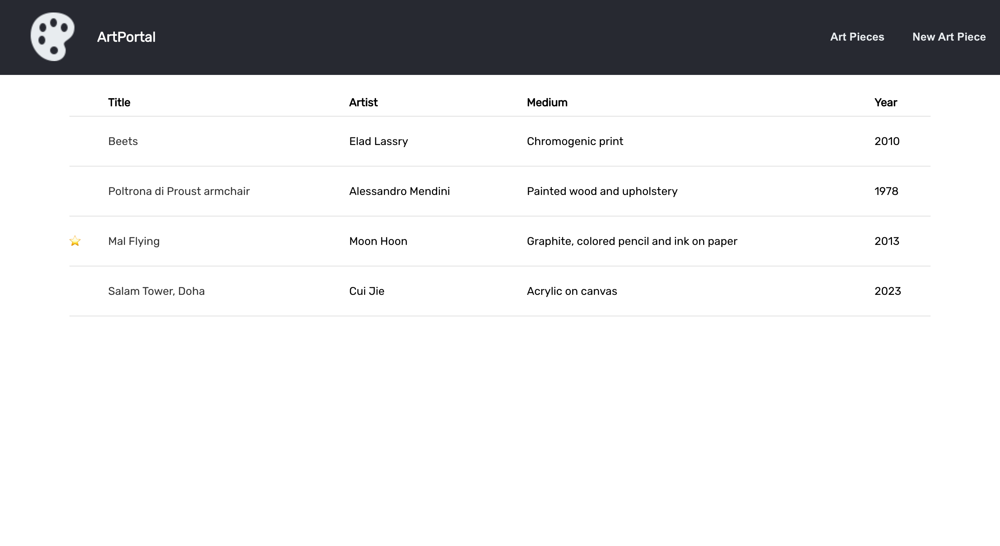
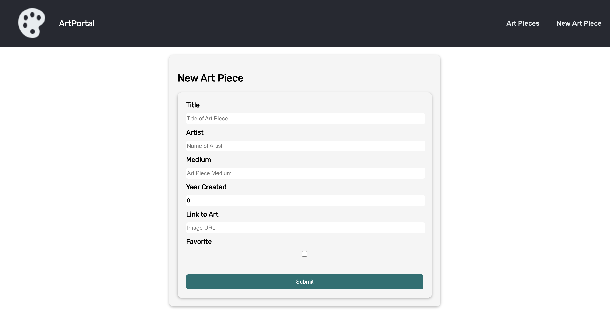
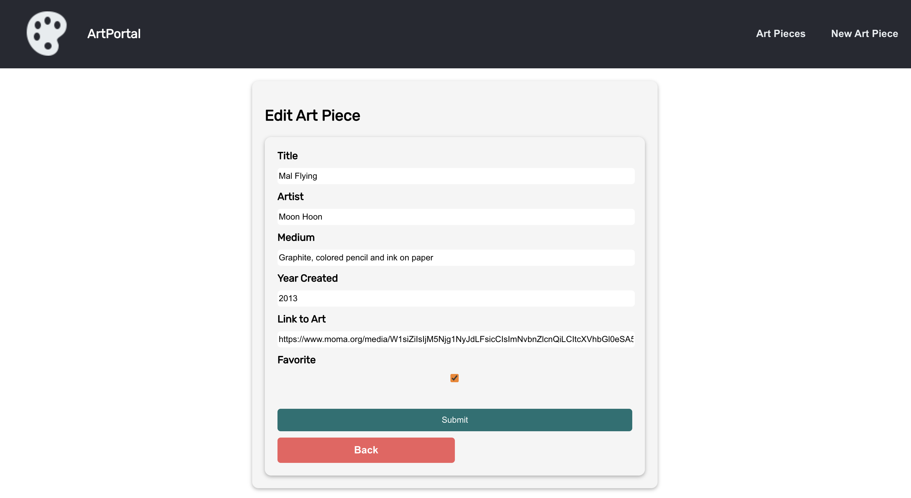
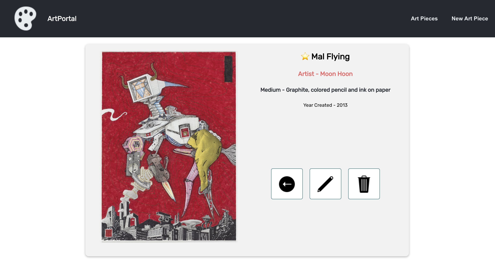
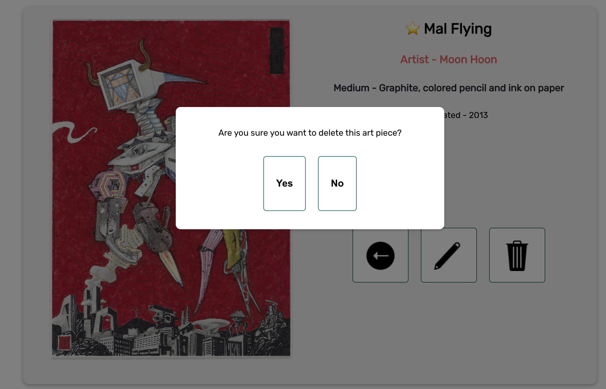

## ArtPortal

An application used to create, read, update, and edit art pieces.

## Project Screen Shot(s)
# Landing Page

The landing page of the app

# Index Page
A user can view all of the art pieces in the database

From this page, a user can click on an art piece to view more details

# New Form
A user can create a new art piece

# Edit Form
A user can edit an already existing art piece

# Details of Art Piece
A user can view an individual art piece

From this page users can edit, delete, or go back to the index page

# Pop Up Modal For Delete
A user will be prompted to confirm deletion of art piece

## Installation and Setup Instructions

Clone down this repository. You will need `node` and `npm` installed globally on your machine.  

Installation:

`npm install`   

To Start Server:

`npm start`  

To Visit App:

`localhost:3000/art-pieces`  

Trello Link: [https://trello.com/b/NEk7gQv5/artportal](https://trello.com/invite/b/NEk7gQv5/ATTI9ff5a7805a2f2bd2744ccbd561e8a84c1BB3FA17/artportal)
